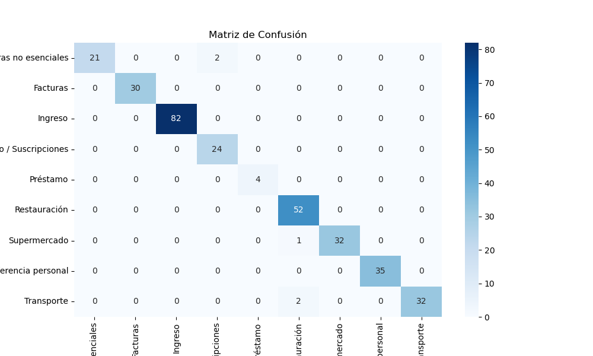
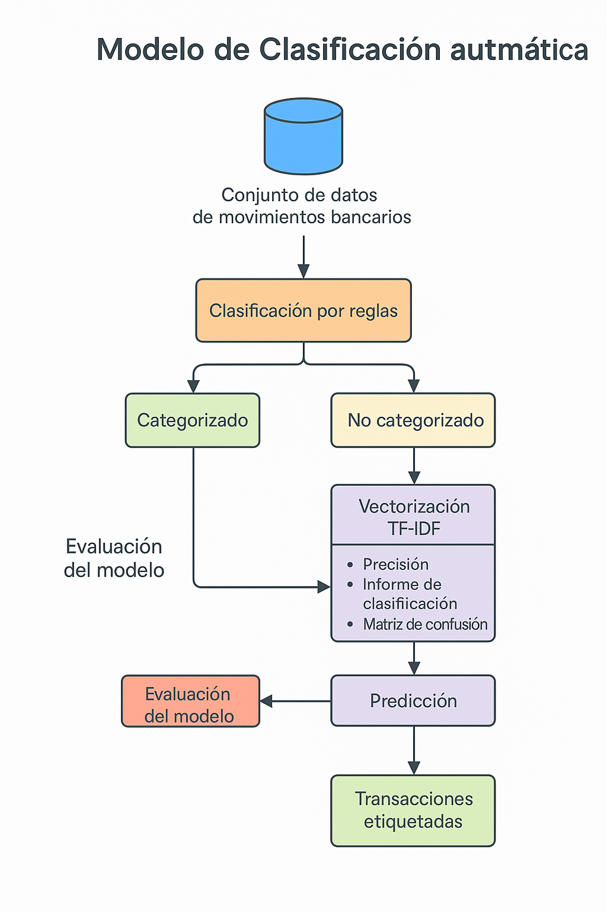
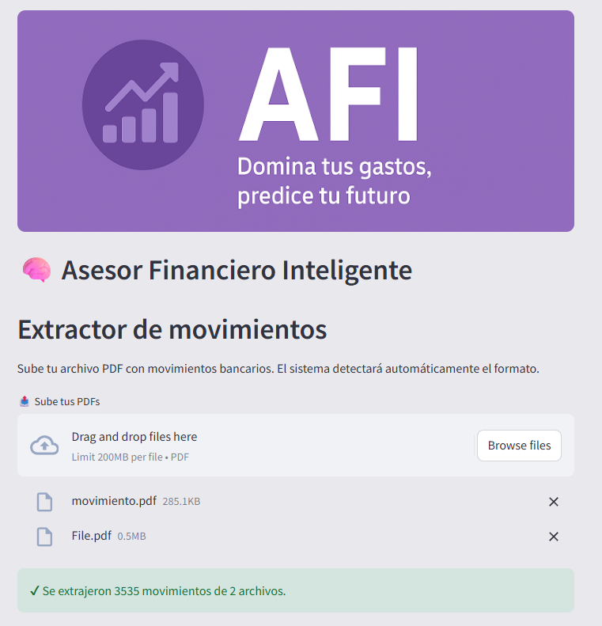
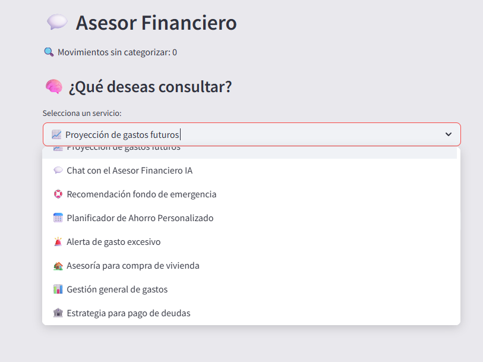

# 🧠 AFI – Asesor Financiero Inteligente
Domina tus gastos, predice tu futuro.

Este proyecto combina extracción automática de movimientos bancarios, categorización inteligente, predicción de gastos y asesoría financiera personalizada. Incluye una interfaz interactiva en Streamlit y un entorno de desarrollo para pruebas, exploración y mejora continua.

Para ello se ha obtenido la información de los movimientos bancarios a través de la carga de PDFs con dicha información, sencilla de obtener por el usuario que vaya a darle uso al proyecto. Se puede cargar tantos archivos como se desee, ya que el script se encarga de unirlos en un único dataset. Tras cargar los movimientos se realiza un proceso de limpieza y montaje de la base de datos en el que se corregirán los textos de los conceptos, se simplificarán las fechas de los movimientos para agruparlos de forma más sencilla por mes, además de incluirse la columna tipo, la cual en función de su signo negativo o positivo los separa como ingreso o gasto.

Posteriormente se procede a crear el modelo que se encargará de automatizar la categorización de cada movimiento. Se categorizan una gran parte de los movimientos teniendo en cuenta sus conceptos siendo las categorías definidas para este proyecto: 

* Compras no esenciales (gastos en tiendas de ropa, electrónica, etc)
* Facturas (Agua, luz, teléfono, etc)
* Ingreso
* Ocio/Suscripciones (Cine, Spotify, HBO, etc)
* Préstamo
* Restauración 
* Supermercado
* Transferencia personal
* Transporte

A través de un modelo de aprendizaje automático supervisado se obtiene la  categorización de los movimientos restantes. La categorización empieza por una clasificación por reglas basada en palabras claves que se encuentran en los conceptos de los movimientos bancarios, los que no pueden ser clasificados por ese sistema se etiquetan como "sin categorizar" y se usan como datos de entrada para entrenar un modelo Random Forest. Para ello su preprocesamiento incluye la vectorización del texto del concepto mediante TF-IDF para presentar cada movimiento como una matriz numérica. Se divide el dataset etiquetado para usar una parte en el entrenamiento y otra en la prueba. Por último se entrena el modelo con Random Forest Classifier de scikit-learn.

Una vez entrenado, puede predecir la categoría de los movimientos no etiquetados ("Sin categorizar"), estos se incorporan al modelo marcando su origen en una columna nueva en la que se indicará "modelo" si viene de este o "manual" si parte de la categorización por reglas. A través de métricas obtenemos el rendimiento del modelo obteniendo un accuracy del 0.9842 en la categorización y se ve su número de errores en la matriz de confusión generada.




Una vez obtenida la clasificación, se realiza la predicción de ingresos y gastos futuros por categoría. Para ello, se selecciona la serie temporal mensual de cada categoría y se utiliza un modelo base tipo Naïve con media móvil que estima los valores futuros de los próximos a partir del promedio de los últimos meses disponibles. El objetivo principal era el desarrollo y uso del modelo prophet de Meta pero ante la poca estacionalidad y falta de periodos de muestra no reflejaba predicciones válidas. por ello el siguiente avance será intentar de nuevo el modelo prophet ampliando la muestra y optimizando todo lo posible los parámetros del modelo y de no ser posible, se explorará el uso de modelos ya preentrenados de Hugging Face

Para el ejemplo toma como fecha de corte el 31 de diciembre de 2024 y realiza un predicción de los siguientes 4 meses, comparando con los valores reales y calculando métricas como MAE, RMSE, MAPE y R^2 para evaluar su rendimiento

Al finalizar el proceso de categorización y predicción, se genera una base de datos más resumida con los aspectos más importantes del dataset final el cual he llamado contexto, este será usado en alguna de las funciones que nombraremos más adelante y lo que hace es aportar un pretexto financiero de la situación del usuario para que las funciones que dan la opción de asesoramiento por IA, pueda detallar o personalizar cada consejo que da, basandose en pruebas y contenido real.

Funcionalidades principales:
* Distribución de gastos: a partir del historial de gastos, la IA sugiere cómo reducir gastos no esenciales e implementar métodos de ahorro como la regla 50/30/20, basándose en importes reales mensuales.

* Plan de ahorro para objetivos concretos: calcula cuánto debería ahorrar el usuario cada mes para alcanzar una meta económica (por ejemplo, 3000 € en 10 meses) y evalúa si es viable según sus ingresos y gastos.

* Fondo de emergencia: estima un fondo de seguridad equivalente a 3 o 6 meses de gastos fijos, indicando cuánto tardaría el usuario en conseguirlo y cómo podría acelerar su construcción reduciendo gastos específicos.

* Asesoría para compra, alquiler o independencia: analiza los ingresos, ahorros y gasto en vivienda del usuario para aconsejar si es buen momento para comprar una casa, seguir alquilado o independizarse. Puede realizarse mediante reglas manuales o mediante IA generativa para obtener una recomendación adaptada.

* Alertas por gasto excesivo: detecta si alguna categoría ha aumentado significativamente su gasto frente a la media reciente, y lo comunica de forma narrativa.

* Gestión de deudas: permite simular estrategias para pagar deudas, comparando los métodos “bola de nieve” (priorizar las más pequeñas) y “avalancha” (priorizar las más caras), calculando el tiempo estimado y los intereses totales de cada estrategia.

La IA ha sido adaptada con prompts específicos para que no de respuestas poco útiles o genéricas y refleje información real y bien estructurada, siendo de gran utilidad para el usuario. Esto convierte el sistema en un asistente financiero personalizado, capaz de responder a preguntas del tipo “¿En qué puedo ahorrar este mes?”, “¿Me conviene alquilar o comprar?” o “¿Cómo reduzco mis deudas más rápido?”.


## Estructura del Proyecto

```bash
AFI/
├── app.py                     # Interfaz Streamlit de usuario
├── main.py                   # Script de ejecución principal (modo consola)
├── models/
│   ├── categorizacion.py     # Clasificador de movimientos
│   ├── ia_asesor.py          # Módulo con funciones del asesor financiero
│   └── prediccion.py         # Predicción de gastos por categoría
├── src/
│   ├── eda.py                # Extracción de datos desde PDFs
│   ├── etl.py                # Limpieza y transformación de datos
│   ├── resumen_datos.py      # Creación de contexto financiero
│   └── visualizaciones.py    # Funciones gráficas
├── streamlit_app/
│   ├── assets/               # Recursos visuales para la app
│   └── historial.py          # Funciones de resumen histórico
├── data/                     # Archivos CSV procesados
├── .env                      # Archivo de entorno para API Key
└── requirements.txt          # Dependencias del proyecto
```

- Cómo Ejecutar:
1. Clonar el repositorio

git clone https://github.com/Ogomez07/Proyecto_TFM.git

2. Crear entorno virtual e instalar dependencias

python -m venv .venv
source .venv/bin/activate  # o .venv\Scripts\activate en Windows
pip install -r requirements.txt
Nota: Crea un archivo .env con tu clave de OpenAI:


## Modo Consola (Análisis paso a paso)
Ejecuta:

python main.py

Esto procesará archivos PDF bancarios, limpiará los datos, clasificará los movimientos, predecirá gastos y generará estrategias de ahorro, deuda o vivienda. Todos los pasos están comentados en el script.

## Modo Interactivo (Interfaz Streamlit)
Ejecuta:

streamlit run app.py

Esto abre una interfaz gráfica con navegación en tres secciones:

Extracción de movimientos: Sube PDFs bancarios y limpia los datos automáticamente.


Predicciones por categorías: Clasifica gastos, descarga CSV y predice valores futuros.
.png)

Asesor financiero: Accede a funcionalidades avanzadas como:



* Chat IA con contexto financiero.

* Recomendación de fondo de emergencia.

* Planificador de ahorro.

* Detección de gastos excesivos.

* Estrategia de pago de deudas (bola de nieve vs avalancha).

* Asesoría personalizada sobre vivienda.

- Tecnologías usadas

Python (pandas, scikit-learn, matplotlib)

Streamlit (interfaz web)

OpenAI API (IA generativa para recomendaciones)

Regex y reglas heurísticas (para clasificación)

Modelos Naïve y métricas (para predicción de gastos)

## Ejemplo de predicción
Predicción mensual de gastos en "Restauración" basada en la media de los últimos meses.

📄 Licencia
MIT – Puedes usarlo, modificarlo y distribuirlo con libertad. Dale crédito al autor si lo compartes.